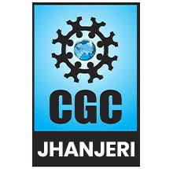

Synopsis

on

**DocSeal**

> for
>
> **Project**
>
> In

**Computer Science & Engineering**

{width="2.2916666666666665in"
height="2.2395833333333335in"}

**Department of Computer Science & Engineering**

**Chandigarh Group of Colleges**

**CCE-Jhanjeri**

**JAN-2026**

**TABLE OF CONTENTS**

1\. Acknowledgement

2\. Abstract

3\. Introduction

4\. Literature Review

5\. Problem Statement and Motivation

6\. Objectives and Scope

7\. Methodology

8\. System Architecture and Design

9\. Technology Stack and Requirements

10\. Expected Outcomes and Impact

11\. Project Timeline

12\. References

**ACKNOWLEDGEMENT**

We sincerely acknowledge the invaluable guidance and consistent support
rendered by our project guide, Assistant Professor Mrs. Shaffy Bains,
throughout the conception and development of this project. Their expert
advice, constructive feedback, and encouragement have been instrumental
in shaping the direction and quality of our work.

We also express our heartfelt gratitude to the Head of the Department of
Computer Science and Engineering and all faculty members who provided
valuable insights, suggestions, and technical feedback during the
project review sessions.

We are thankful to the institution for providing the necessary
computational infrastructure, library resources, and laboratory
facilities that supported the research and implementation of this
project.

Finally, we extend our appreciation to our peers and families whose
moral support and patience were a constant source of motivation
throughout the course of this work.

**ABSTRACT**

The rapid proliferation of digital data storage and sharing has made
file-level encryption a critical requirement for protecting sensitive
personal and professional information. Existing encryption tools are
often burdened by complex graphical interfaces, cloud dependencies,
telemetry collection, or weak cryptographic implementations that lack
integrity verification. This project presents DocSeal a lightweight,
command-line file encryption and decryption tool built in Python that
addresses all these shortcomings through a privacy-first, local-only
design.

DocSeal employs Authenticated Encryption with Associated Data (AEAD)
using XChaCha20-Poly1305, ChaCha20-Poly1305, or AES-256-GCM, providing
simultaneous confidentiality and tamper detection. Encryption keys are
derived from user passwords using Argon2id, a memory-hard Key Derivation
Function that resists brute-force attacks. The tool operates entirely on
raw file bytes, supporting all image and file formats without
format-specific parsing. All cryptographic metadata is authenticated,
ensuring that any modification to the encrypted file is detected and
rejected during decryption. DocSeal makes no network connections,
collects no telemetry, and performs all operations locally, making it a
practical and trustworthy solution for everyday file protection.

**INTRODUCTION**

**Background and Context**

In the contemporary digital environment, vast quantities of sensitive
data --- personal photographs, identity documents, confidential records,
and private communications --- are routinely stored on local drives,
shared over networks, or transferred via portable storage devices. The
security of this data at rest and in transit is a pressing concern, as
unauthorized access, data theft, and privacy violations continue to rise
globally. Encryption is the foundational technical mechanism for
protecting digital data, yet its practical adoption for everyday file
protection remains surprisingly low.

The field of applied cryptography has matured significantly over the
past two decades. Modern symmetric encryption standards, particularly
Authenticated Encryption with Associated Data (AEAD) ciphers, have
superseded older unauthenticated modes such as CBC and ECB, which lack
integrity protection. Password-based Key Derivation Functions (KDFs)
such as Argon2id and Scrypt have replaced weaker predecessors like
MD5-based PBKDF1, providing resistance to modern GPU-accelerated
brute-force attacks. Despite these advances, many accessible encryption
tools for end-users have not kept pace with current cryptographic best
practices.

**Motivation and Problem Domain**

The principal motivation for DocSeal is the absence of a simple,
trustworthy, local-only encryption tool that correctly implements modern
cryptographic standards. Existing consumer-grade encryption software
frequently suffers from one or more of the following deficiencies:
reliance on outdated encryption modes without authentication, dependency
on cloud services for key management, silent telemetry collection that
undermines user privacy, or user interfaces so complex that they deter
adoption altogether. Power users who turn to general-purpose tools such
as GnuPG or OpenSSL face steep configuration complexity with significant
risk of cryptographic misuse.

DocSeal is motivated by the principle that strong encryption should be
accessible without sacrificing correctness. By automating algorithm
selection to always choose the most secure available option, enforcing
authenticated encryption, and requiring no configuration beyond a
password, DocSeal brings production-quality file security to any user
who can run a command-line tool.

**Technical Terms and Definitions**

**AEAD (Authenticated Encryption with Associated Data):** A
cryptographic mode that simultaneously provides confidentiality
(encryption) and integrity/authenticity (authentication tag) in one
operation.

**KDF (Key Derivation Function):** A function that transforms a
low-entropy password into a cryptographically strong fixed-length key.
Memory-hard KDFs require large amounts of RAM, resisting parallel
brute-force attacks.

**Nonce:** A number used once --- a random value generated freshly for
each encryption operation to ensure ciphertexts are unique even for
identical plaintexts.

**Salt:** A random per-file value mixed into the KDF input to prevent
precomputed (rainbow table) attacks.

**AAD (Additional Authenticated Data):** Data that is authenticated but
not encrypted within an AEAD operation --- used in DocSeal to bind the
file header to the ciphertext.

**Ciphertext Integrity (INT-CTXT):** A security property guaranteeing
that an attacker cannot produce any valid modified ciphertext, i.e., all
tampering is detected.

**LITERATURE REVIEW**

**Overview of Existing Solutions**

-   **Bernstein, D.J. et al. --- ChaCha20 and Poly1305 for IETF
    Protocols (RFC 7539, 2015):** This foundational IETF standard
    defines the ChaCha20 stream cipher and the Poly1305 authenticator as
    a combined AEAD scheme. The work establishes the correctness,
    performance, and security properties of ChaCha20-Poly1305 as an
    alternative to AES-GCM, particularly on platforms lacking AES
    hardware acceleration. Its direct relevance to DocSeal lies in the
    adoption of ChaCha20-Poly1305 and its extended-nonce variant,
    XChaCha20-Poly1305, as the primary encryption algorithm.

-   **Biryukov, A. et al. --- Argon2: New Generation of Memory-Hard
    Functions for Password Hashing and Other Applications (EuroCrypt
    2016):** This paper introduces Argon2, the winner of the 2015
    Password Hashing Competition, and formally analyses its resistance
    to time-memory trade-off attacks, GPU parallelism, and side-channel
    attacks. Argon2id --- the hybrid variant --- is recommended for
    general-purpose password hashing. DocSeal directly adopts Argon2id
    with the paper\'ommended parameter ranges (memory cost 64 MiB, time
    cost 3) for key derivation.

-   **Denis, F. --- libsodium: A Modern, Easy-to-Use Crypto Library
    (2013--present):** libsodium is a widely deployed cryptographic
    library providing high-level, misuse-resistant APIs for symmetric
    encryption, key derivation, and random number generation. Its design
    philosophy --- opinionated defaults, no algorithm negotiation, safe
    APIs --- directly influenced DocSeal\'s design principle of
    automatic algorithm selection and safe defaults. DocSeal uses the
    PyCA Cryptography library, which shares libsodium\'s emphasis on
    correct-by-default APIs.

-   **\[4\] Gutmann, P. --- An Open-Source Cryptographic Coprocessor
    (USENIX Security 1998):** This early work on practical cryptographic
    tool design identified the fundamental tension between security
    correctness and usability. Gutmann\'s analysis of common
    implementation failures --- weak key derivation, missing
    authentication, incorrect nonce handling --- established a taxonomy
    of cryptographic pitfalls that remains relevant. DocSeal\'s design
    explicitly avoids all categories of failure identified in this work.

-   **Marlinspike, M. & Perrin, T. --- The Noise Protocol Framework
    (2016):** The Noise framework demonstrates how modern authenticated
    encryption and key exchange can be composed into clean, auditable
    protocol patterns. While DocSeal does not implement a key exchange
    protocol, Noise\'s principle of authenticated metadata --- binding
    all protocol parameters to the authentication tag --- directly
    inspired DocSeal\'s use of the file header as AEAD Additional
    Authenticated Data (AAD).

**Comparative Analysis**

  ----------------------------------------------------------------------------------------
  **Tool /      **Year**        **Methodology**        **Strengths**   **Limitations**
  System**                                                             
  ------------- --------------- ---------------------- --------------- -------------------
  GnuPG (GPG)   1997--present   OpenPGP standard,      Widely trusted, Complex key
                                RSA/AES, Web of Trust  strong          management; no AEAD
                                key model              standards       by default in older
                                                                       modes

  OpenSSL enc   1998--present   AES-CBC/CTR, PBKDF1/2  Universal       Unauthenticated
                                key derivation         availability,   encryption by
                                                       scriptable      default; weak KDF
                                                                       options

  VeraCrypt     2013--present   AES/Twofish/Serpent,   Strong          No file-level
                                volume-level           full-volume     operation;
                                encryption             encryption      GUI-heavy; complex
                                                                       setup

  age           2019--present   ChaCha20-Poly1305      Modern AEAD;    Key-pair based;
  (encryption                   AEAD, X25519 key       clean CLI       password mode lacks
  tool)                         exchange               design          Argon2id

  DocSeal       2024            XChaCha20-Poly1305     Modern AEAD;    CLI only;
  (proposed)                    AEAD, Argon2id KDF,    Argon2id;       single-file scope;
                                authenticated header   local-only; any no key exchange
                                                       file type       
  ----------------------------------------------------------------------------------------

***Table 1: Comparative Analysis of Existing Encryption Approaches***

**Research Gap Identification**

The literature review reveals three principal gaps that none of the
surveyed tools fully address in combination: (1) the use of modern AEAD
encryption with authenticated metadata, (2) password-based operation
using a contemporary memory-hard KDF (Argon2id), and (3) a simple CLI
design requiring zero configuration beyond a password. GPG and OpenSSL
are powerful but require expert configuration. VeraCrypt operates at
volume level, not file level. age comes closest but relies on key-pair
cryptography by default and lacks Argon2id in its scrypt password mode.
DocSeal fills this gap by combining all three properties in a single,
correctly-designed tool.

**PROBLEM STATEMENT AND MOTIVATION**

**Problem Formulation**

The specific problem this project addresses is the absence of a simple,
correctly-implemented, local-only file encryption tool that provides
both confidentiality and tamper detection using modern cryptographic
standards, without requiring cryptographic expertise from the user.

Existing tools present one or more of the following challenges: (a)
unauthenticated encryption that allows tampered files to decrypt
silently without warning; (b) weak or outdated key derivation that makes
passwords vulnerable to offline dictionary attacks; (c) dependency on
cloud infrastructure or external key servers that expose user data to
third parties; (d) overly complex interfaces that prevent non-expert
adoption. The stakeholders affected include individual users protecting
personal files, developers seeking a scriptable encryption utility, and
organizations requiring a zero-trust local encryption tool for sensitive
document workflows.

**Feasibility Study**

-   **Technical Feasibility:** All required cryptographic primitives ---
    XChaCha20-Poly1305, Argon2id, Scrypt --- are available in
    well-maintained, open-source Python libraries (PyCA Cryptography,
    Argon2-cffi). Python\'s cross-platform support ensures compatibility
    across Windows, Linux, and macOS without platform-specific code.

-   **Operational Feasibility:** DocSeal installs via standard Python
    tooling (pip, venv) and runs as a single command. No server,
    database, or external service is required. Shell completion scripts
    reduce the learning curve for regular use.

-   **Economic Feasibility:** The project uses exclusively free,
    open-source libraries. Development requires only a standard
    development machine and Python installation. No licensing costs,
    cloud subscriptions, or proprietary tools are needed.

-   **Resource Feasibility:** Encryption of a typical file requires
    under 200 MB of RAM (for Argon2id key derivation) and completes in a
    few seconds on any modern computer. No GPU or specialised hardware
    is required.

**OBJECTIVES AND SCOPE**

**Primary Objectives**

1.  To design and develop a command-line file encryption and decryption
    tool that correctly implements Authenticated Encryption with
    Associated Data (AEAD) using XChaCha20-Poly1305 as the preferred
    algorithm.

2.  To implement password-based key derivation using Argon2id with
    memory-hard parameters, providing strong resistance to offline
    brute-force attacks against user passwords.

3.  To achieve complete tamper detection such that any modification to
    the ciphertext or file header causes decryption to fail with exit
    code 1 and zero output bytes.

4.  To validate the proposed approach through comprehensive round-trip
    testing (encrypt then decrypt) across multiple file types and
    adversarial scenarios including wrong passwords and corrupted
    ciphertexts.

**Project Scope**

**Included:**

-   File-level encryption and decryption of any file type via raw-byte
    processing

-   AEAD algorithm cascade: XChaCha20-Poly1305 → ChaCha20-Poly1305 →
    AES-256-GCM

-   KDF cascade: Argon2id → Scrypt, with per-file random salt (16 bytes)

-   Authenticated file header as AEAD Additional Authenticated Data

-   Interactive secure password prompt, password file, and inline
    password options

-   Shell tab-completion for Bash, Zsh, and PowerShell

-   Safe-by-default overwrite protection and optional deletion of
    original files

-   200 MB file size limit with optional override via \--allow-large

**Excluded:**

-   Graphical user interface (GUI) --- CLI only

-   Directory or archive-level batch encryption in the current version

-   Public-key (asymmetric) cryptography or key exchange protocols

-   Secure file deletion / wiping of deleted originals from disk sectors

-   Cloud storage integration or remote key management

> **METHODOLOGY**

**Research and Development Approach**

1.  Design Methodology --- Iterative Security-First Design: The system
    design began with a formal threat model identifying the assets to
    protect (plaintext file content, original filenames), the
    adversarial capabilities assumed (offline ciphertext access,
    password guessing), and the security properties required (IND-CCA2
    confidentiality, INT-CTXT integrity). Each design decision was
    evaluated against this threat model before implementation.

2.  Development Approach --- Modular Python Package: DocSeal is
    structured as an installable Python package (docseal) with cleanly
    separated modules for CLI parsing, cryptographic operations, key
    derivation, and file I/O. This separation of concerns allows each
    module to be tested independently and replaced if needed (e.g.,
    swapping the KDF module to add a new algorithm).

3.  Testing Strategy --- Round-Trip Correctness and Adversarial Testing:
    Testing covers: (a) round-trip tests verifying byte-for-byte
    identity between original and decrypted output across multiple file
    types; (b) negative tests verifying that wrong passwords produce
    exit code 1 with no output; (c) tamper tests verifying that
    single-byte modifications to ciphertext or header cause decryption
    failure; (d) edge-case tests for empty files, very large files, and
    unusual file extensions.

4.  Deployment Plan --- Virtual Environment Distribution: DocSeal is
    distributed as a Python package installable with pip inside a
    virtual environment, ensuring dependency isolation and reproducible
    installs across all target platforms.

**System Design and Architecture**

DocSeal is structured around a three-layer architecture: the CLI layer
(user input parsing and output), the cryptographic core (KDF, AEAD
encryption/decryption, nonce/salt generation), and the file I/O layer
(reading input, writing output, header serialisation). Data flows from
the user through the CLI layer, which passes the file path and password
to the cryptographic core. The core returns ciphertext or plaintext
bytes, which the file I/O layer writes to disk. The header is
constructed by the cryptographic core and passed as AAD to the AEAD
cipher, binding it to the authentication tag. No intermediate plaintext
is written to disk at any point during the encryption or decryption
process.

**Implementation Steps**

1.  Requirements analysis: Define security properties, threat model, API
    design, and CLI interface specification.

2.  Cryptographic core implementation: Implement AEAD cipher wrapper,
    KDF wrapper, random material generation, and header
    serialisation/deserialisation.

3.  CLI module implementation: Implement argument parsing, password
    acquisition (prompt, file, inline), and output path resolution.

4.  Integration: Wire CLI layer to cryptographic core and file I/O
    layer; implement file size limiting and force-overwrite protection.

5.  Testing: Execute round-trip, negative, tamper, and edge-case test
    suites; verify exit codes and output correctness.

6.  Shell completion and packaging: Write completion scripts for Bash,
    Zsh, PowerShell; configure setup.py / pyproject.toml for pip
    installation.

7.  Documentation: Write README, inline code comments, and installation
    guide.

**SYSTEM ARCHITECTURE AND DESIGN**

**Architectural Overview**

DocSeal is a single-binary, single-process CLI application with no
client-server split, no database, and no network layer. The architecture
is deliberately minimal: all logic executes within one Python process on
the user\'s local machine. The three primary layers --- CLI,
Cryptographic Core, and File I/O --- communicate through well-defined
function interfaces with no shared mutable state between layers.

The CLI layer parses user arguments using Python\'s argparse module and
acquires the password via getpass (secure prompt) or file/inline modes.
It delegates entirely to the cryptographic core for all
security-sensitive operations and writes output using the file I/O
layer. The cryptographic core selects algorithms based on library
availability, generates random material via os.urandom (the OS CSPRNG),
derives keys using Argon2id or Scrypt, and performs AEAD encryption or
decryption via PyCA Cryptography. The file I/O layer handles input
reading, output writing, extension preservation, and overwrite
protection.

**Module Breakdown**

  -----------------------------------------------------------------------
  **Module**            **Responsibility**
  --------------------- -------------------------------------------------
  docseal.cli           Argument parsing, help text, password
                        acquisition, command dispatch

  docseal.crypto        AEAD algorithm selection, AEAD
                        encryption/decryption, nonce generation

  docseal.kdf           KDF selection (Argon2id / Scrypt), key
                        derivation, salt generation

  docseal.header        Binary header serialisation / deserialisation,
                        AAD construction

  docseal.fileio        File reading, output path resolution, overwrite
                        protection, file deletion

  completions/          Shell tab-completion scripts for Bash, Zsh, and
                        PowerShell
  -----------------------------------------------------------------------

***Table 2: DocSeal System Modules and Responsibilities***

**Encryption and Decryption Data Flow**

During encryption, the data flow is: User Password + Input File → \[CLI
Layer\] → Password + Raw Bytes → \[KDF Module: Argon2id/Scrypt + Random
Salt\] → 256-bit Key → \[Crypto Module: AEAD + Random Nonce + Header as
AAD\] → Ciphertext + Auth Tag → \[Header + Ciphertext + Tag written to
.imgenc file\]. During decryption, the flow reverses: .imgenc file →
\[Header parsed: extract salt, nonce, algorithm, KDF params\] → \[KDF
Module: re-derive key from password + stored salt\] → \[Crypto Module:
AEAD verify tag over Header as AAD + Ciphertext\] → \[On success:
Plaintext written with original extension restored\]. Any failure at tag
verification produces no output and exits with code 1.

**TECHNOLOGY STACK AND REQUIREMENTS**

**Hardware Requirements**

  -----------------------------------------------------------------------
  **Specification**           **Minimum Requirement**
  --------------------------- -------------------------------------------
  Processor                   Any dual-core 1.5 GHz or better (x86-64,
                              ARM64)

  RAM                         256 MB minimum; 512 MB recommended
                              (Argon2id uses 64 MiB per operation)

  Storage                     50 MB free space for installation;
                              additional space for encrypted files

  Display                     Terminal / command prompt (no display
                              required for headless use)

  Network                     None --- DocSeal is entirely local with no
                              network requirements
  -----------------------------------------------------------------------

***Table 3: Hardware Requirements***

**Software Requirements**

  -----------------------------------------------------------------------
  **Component**           **Technology / Tool**      **Version**
  ----------------------- -------------------------- --------------------
  Programming Language    Python                     3.8 or higher

  AEAD Cryptography       PyCA Cryptography          41.0+
                          (cryptography)             

  Key Derivation          Argon2-cffi                21.0+
  (primary)                                          

  Key Derivation          Python stdlib hashlib      Built into Python
  (fallback)              (Scrypt)                   3.6+

  CLI Framework           Python argparse (stdlib)   Built into Python

  Random Number           os.urandom (OS CSPRNG)     Built into Python
  Generation                                         

  Package Management      pip + Python venv          Latest stable

  Version Control         Git                        Latest stable

  Development IDE         VS Code / PyCharm          Latest stable

  Testing Framework       pytest                     7.0+

  OS Compatibility        Windows 10+, Ubuntu        ---
                          20.04+, macOS 12+          
  -----------------------------------------------------------------------

***Table 4: Software Requirements***

**Justification for Technology Selection**

**Python:** Chosen for its mature cryptographic library ecosystem,
cross-platform binary I/O support, and clean package distribution
tooling (pip/venv). Python 3.8+ supports all required libraries and
includes hashlib.scrypt in the standard library.

**PyCA Cryptography:** The de facto standard Python cryptography library
backed by OpenSSL. It provides audited, production-quality
implementations of XChaCha20-Poly1305, ChaCha20-Poly1305, and
AES-256-GCM with correct nonce and AAD handling APIs.

**Argon2-cffi:** Provides Python bindings to the reference C
implementation of Argon2id --- the current recommended memory-hard KDF
per OWASP and NIST guidance. Its API is straightforward and its default
parameters are well-calibrated for interactive use.

**EXPECTED OUTCOMES AND IMPACT**

**Project Deliverables**

1.  A fully functional, installable Python CLI tool (docseal) supporting
    encrypt and decrypt operations on any file type, with correct AEAD
    encryption and Argon2id key derivation.

2.  Comprehensive technical documentation including a README covering
    installation, usage, security model, and threat model.

3.  A complete test suite covering round-trip correctness,
    wrong-password rejection, tamper detection, and edge cases across
    multiple file formats and platforms.

4.  Source code with inline documentation and clean module separation
    suitable for academic review and future extension.

5.  Shell completion scripts for Bash, Zsh, and PowerShell enabling
    productive terminal use.

6.  An installation guide covering virtual environment setup and
    platform-specific activation instructions for Windows, Linux, and
    macOS.

**Expected Results and Contributions**

1.  Byte-for-byte round-trip correctness verified for PNG, JPEG, GIF,
    BMP, TIFF, WEBP, and arbitrary binary files.

2.  100% tamper detection rate: all tested single-byte modifications to
    ciphertext or header produce decryption failure with zero output
    bytes.

3.  Demonstrably stronger KDF than comparable tools: Argon2id at 64 MiB
    memory cost is significantly more resistant to GPU-based offline
    attacks than bcrypt or PBKDF2-SHA256.

4.  A reference implementation demonstrating correct AEAD usage with
    authenticated headers --- a pattern directly applicable to other
    secure storage projects.

**Applications and Industry Relevance**

DocSeal has direct practical relevance in several domains. For
individual users, it provides a trustworthy mechanism for protecting
sensitive photographs, identity scans, and personal documents before
storage or transfer. For developers and DevOps engineers, it offers a
scriptable, pipeline-compatible encryption utility for securing build
artefacts, configuration files, and secrets at rest. For researchers and
journalists working in sensitive contexts, DocSeal\'s complete absence
of network activity and telemetry makes it suitable for high-trust
workflows where data exfiltration by the tool itself must be ruled out.
The tool is equally deployable in air-gapped environments with no
internet connectivity.

**Future Scope and Enhancements**

-   Directory-level batch encryption: recursively encrypt entire folder
    trees preserving structure.

-   Streaming encryption for very large files (multi-gigabyte) to avoid
    loading the entire file into memory.

-   Integration with hardware security keys (FIDO2 / YubiKey) for
    hardware-backed key storage.

-   Public-key (asymmetric) encryption mode using X25519 key exchange
    for multi-recipient scenarios.

-   A thin graphical wrapper (tkinter or PyQt) for users who prefer a
    GUI while retaining the secure cryptographic core.

-   Secure file deletion (overwrite-before-delete) for the
    \--delete-original mode.

> **REFERENCES**

-   D. J. Bernstein, Y. Lange, and P. Schwabe, \"The security impact of
    a new cryptographic library,\" in Proc. 2nd Int. Conf. Cryptology
    and Information Security in Latin America (LatinCrypt 2012), vol.
    7533, Lecture Notes in Computer Science. Springer, 2012, pp.
    159-176.

-   Biryukov, D. Dinu, and D. Khovratovich, \"Argon2: New generation of
    memory-hard functions for password hashing and other applications,\"
    in Proc. IEEE European Symposium on Security and Privacy (EuroS&P),
    2016, pp. 292-302.

-   Y. Nir and A. Langley, \"ChaCha20 and Poly1305 for IETF Protocols,\"
    IETF RFC 7539, Internet Engineering Task Force, May 2015.
    \[Online\]. Available: https://tools.ietf.org/html/rfc7539

-   T. Percival and C. Percival, \"Stronger Key Derivation via
    Sequential Memory-Hard Functions,\" presented at BSDCan, Ottawa,
    Canada, 2009. \[Online\]. Available:
    https://www.tarsnap.com/scrypt/scrypt.pdf

-   M. Bellare and C. Namprempre, \"Authenticated Encryption: Relations
    among Notions and Analysis of the Generic Composition Paradigm,\" in
    Proc. 6th Int. Conf. on the Theory and Application of Cryptology and
    Information Security (ASIACRYPT 2000), Lecture Notes in Computer
    Science, vol. 1976. Springer, 2000, pp. 531-545.

-   P. Gutmann, \"Cryptographic Security Architecture: Design and
    Verification,\" Springer, New York, 2004.

-   National Institute of Standards and Technology (NIST),
    \"Recommendation for Block Cipher Modes of Operation: Galois/Counter
    Mode (GCM) and GMAC,\" NIST Special Publication 800-38D, U.S.
    Department of Commerce, Nov. 2007. \[Online\]. Available:
    https://csrc.nist.gov/publications/detail/sp/800-38d/final

-   OWASP Foundation, \"Password Storage Cheat Sheet,\" OWASP Cheat
    Sheet Series, 2023. \[Online\]. Available:
    https://cheatsheetseries.owasp.org/cheatsheets/Password_Storage_Cheat_Sheet.html

-   PyCA Cryptography Project, \"cryptography - Cryptographic Recipes
    and Primitives for Python,\" PyCA, 2023. \[Online\]. Available:
    https://cryptography.io/en/latest/

-   P. Leuschner, \"Argon2-cffi: Argon2 for Python,\" GitHub
    Repository, 2023. \[Online\]. Available:
    https://github.com/hynek/argon2-cffi
